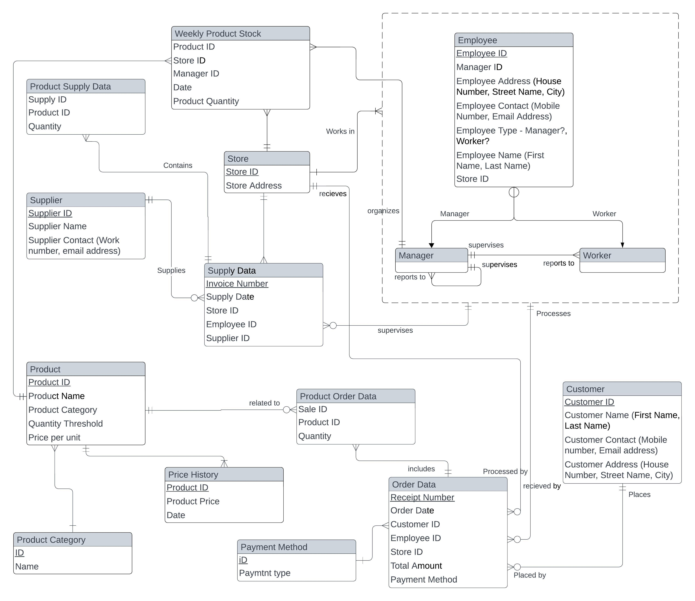

# Database design and development for Omart Stores

Omart stores is a retail and wholesales business, specialized in baby essentials. SHe operates two stores in Lagos, Nigeria, each stroe with three employees (manager inclusive)

## Purpose of Project
- Manage inventory for 300+ products in all stores
- Track employee sales activities
- Analyze orders and supplies
- Analyze products price trends

## E-R Diagram
Diagram on [Lucid Chart](https://lucid.app/lucidchart/0ab3b63c-3f9c-4e07-8578-2bd2adeaa932/edit?viewport_loc=-1802%2C-158%2C5667%2C2449%2C0_0&invitationId=inv_4192707b-c183-4171-8c4b-82fa3e7ed491)

## Implementation
Database and table implementation [here](init.sql)

## Data seed
Data seed for test [here](seed-db.sql)

